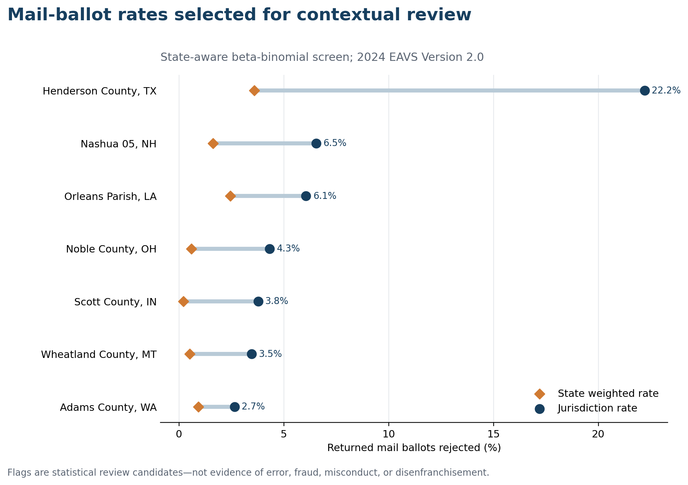

# From Outlier to Review Queue

## A responsible screen of 2024 election-administration data

**Zuhair Taha | Election Administration Data Monitor | August 2026**

## Executive summary

This project asked which local election jurisdictions reported unusual 2024 mail-ballot rejection rates after accounting for denominator size, internal data quality, and state context. The analysis used Version 2.0 of the U.S. Election Assistance Commission's 2024 Election Administration and Voting Survey (EAVS).

The quality-controlled dataset contained 2,621 jurisdictions eligible for mail-ballot comparison. A within-state beta-binomial screen successfully modeled 2,605 jurisdictions across 43 states and territories and selected seven records for contextual review.

The review did **not** establish error, fraud, misconduct, or disenfranchisement. Instead, it produced four evidence categories:

- **One externally corroborated record:** Washington's official annual report independently published an Adams County rejection rate of 2.64%, nearly identical to the 2.65% rate calculated from EAVS.
- **Four internally reconciled records:** detailed EAVS reason counts exactly accounted for the rejection total, and official state policy was consistent with the reported categories, but no independent jurisdiction-level count was located.
- **One partially reconciled record:** Scott County's known reason counts covered 74.7% of rejections, and the EAVS comment documented a multi-system reporting limitation.
- **One unresolved record:** Noble County's aggregate arithmetic was valid, but its detailed reason fields were all zero and the public official sources reviewed did not provide a comparable mail-ballot rejection table.

Every selected jurisdiction passed the aggregate arithmetic check: counted ballots plus rejected ballots equaled returned ballots. The review therefore shifted attention away from simple data-entry error and toward administrative timing, signature verification, ballot curing, and missing reason detail.

## What the screen found



The screen compares each eligible jurisdiction only with peers in the same state. A record is selected when its beta-binomial upper-tail probability passes a within-state Bonferroni threshold and the lower bound of its 95% Wilson interval is above the state's weighted rate. The model is a prioritization tool, not a causal or legal finding.

| Jurisdiction | EAVS rate | State rate | Dominant reported reason | Evidence status |
|---|---:|---:|---|---|
| Henderson County, Texas | 22.21% | 3.59% | Late arrival: 221 of 309 | Internally reconciled |
| Nashua Ward 5, New Hampshire | 6.54% | 1.62% | Voter already voted: 37 of 45 | Internally reconciled |
| Orleans Parish, Louisiana | 6.06% | 2.44% | Late arrival: 273 of 571 | Internally reconciled |
| Noble County, Ohio | 4.33% | 0.59% | No reason detail reported | Unresolved |
| Scott County, Indiana | 3.78% | 0.21% | Late arrival: 135 of 198 | Partially reconciled |
| Wheatland County, Montana | 3.47% | 0.52% | Signature mismatch: 23 of 24 | Internally reconciled |
| Adams County, Washington | 2.65% | 0.92% | Signature mismatch: 121 of 147 | Externally corroborated |

Rates are calculated from EAVS as rejected mail ballots divided by returned mail ballots. State rates are weighted by reported ballot counts among eligible jurisdictions.

## Context changed the interpretation

### Late-arrival patterns

Late arrival was the largest reported reason in Henderson County, Orleans Parish, and Scott County. Official state sources show that deadlines differ and matter operationally:

- Texas set the regular receipt deadline at 7 p.m. on Election Day, subject to limited statutory exceptions. Henderson County's reason detail exactly reconciles to its total, with late ballots accounting for 71.5% of rejections. [Texas 2024 election law calendar](https://www.sos.state.tx.us/elections/laws/advisory2024-17-nov-5-dec-14-2024-election-calendar.shtml)
- Louisiana requires specific voter and witness information on the certificate envelope and describes a pre-election cure process for certain deficiencies. Orleans Parish's reason detail exactly reconciles; late arrival was 47.8% of rejections and missing witness signatures were another 18.4%. [Louisiana absentee-voting guidance](https://www.sos.la.gov/elections-voting/absentee-voting-faqs)
- Indiana's November 2024 bulletin set a 6 p.m. Election Day receipt deadline for ordinary mailed absentee ballots. Scott County's EAVS comment also says the aggregate and detailed reason counts came from different reporting systems, which is consistent with the 50-ballot reason gap. [Indiana Election Division bulletin](https://www.in.gov/sos/elections/files/Dispatch.Nov-2024.FINAL.pdf)

These records are strong candidates for operational questions about ballot-return timing and public guidance. They are not evidence of improper voting.

### Signature-verification patterns

Nonmatching signatures accounted for 95.8% of Wheatland County's reported rejections and 82.3% of Adams County's.

Montana's official voter guidance describes a process for resolving a rejected ballot with a signature form and identification. EAVS reports that 44 Wheatland County ballots entered curing, 16 were successfully cured, and 28 were not. [Montana rejected-ballot guidance](https://votemt.gov/resolve-my-ballot/)

Adams County has the strongest external corroboration in the review. Washington's 2024 annual report independently gives the county a 2.64% general-election rejection rate, compared with 2.65% in EAVS. The state report also shows that the county rate was 2.41% in 2023 and identifies signature mismatch as the leading statewide reason in the 2024 general election. [Washington 2024 Annual Elections Report](https://www.sos.wa.gov/sites/default/files/2025-10/2024%20Annual%20Elections%20Report.pdf)

### A label that requires special care

Nashua Ward 5 reported 37 of 45 rejections in the EAVS category “voter already voted.” That phrase should not be converted into an allegation. New Hampshire law explicitly governs what happens when an absentee-voter notation and an attempt to vote in person intersect. The EAVS reason counts reconcile exactly, but no independent ward-level rejection table was located. [New Hampshire RSA 659:55](https://gc.nh.gov/rsa/html/LXIII/659/659-55.htm)

### The unresolved reporting gap

Noble County reported 901 returned mail ballots, 862 counted ballots, and 39 rejected ballots, so the aggregate arithmetic is exact. Yet all detailed rejection-reason fields are zero. The county's official results list 3,181 “absentee” ballots, but that broader Ohio category includes in-person absentee voting and is not directly comparable with the EAVS mail-only denominator. The responsible result is therefore **unresolved**, not “confirmed anomaly.” [Noble County 2024 official results](https://www.boe.ohio.gov/noble/c/elecres/20241105results.pdf)

## What this analysis can and cannot say

This analysis can identify reported values that warrant follow-up, document whether totals reconcile, describe the reasons recorded in EAVS, and distinguish corroborated evidence from policy context.

It cannot determine why an individual ballot was rejected, evaluate the correctness of an election official's legal decision, infer voter intent, or establish misconduct. EAVS is a biennial administrative survey assembled from decentralized systems, and comparable public local documentation is uneven.

The strongest next step would be a documented records request or direct inquiry to the relevant election office for a certified rejection-reason report, beginning with Noble County and then the internally reconciled jurisdictions. Any response should be appended without overwriting the original EAVS record or the evidence status used here.

## Reproducibility

The contextual review is generated from the official EAVS source, the statistical triage output, and a version-controlled source registry:

```bash
python scripts/download_eavs.py
python scripts/audit_source_data.py
python scripts/build_analysis_dataset.py
python scripts/run_outlier_triage.py
python scripts/create_figures.py
python scripts/build_context_review.py
python scripts/create_brief_pdf.py
python -m unittest discover -s tests -v
```

Machine-readable outputs are available in [`context_review.csv`](context_review.csv) and [`context_review_summary.json`](context_review_summary.json). The source registry is in [`../data/context_sources.json`](../data/context_sources.json), and full model details are documented in [`../docs/methodology.md`](../docs/methodology.md).

## Bottom line

The project's contribution is not the production of a dramatic outlier list. It is the conversion of a statistical screen into a disciplined review queue with explicit evidence levels. One candidate was independently corroborated, five were materially clarified by internal reason detail and official context, and one remained unresolved. Preserving that uncertainty is part of the result.
